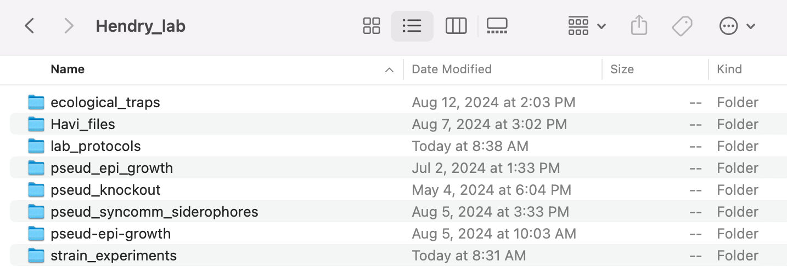
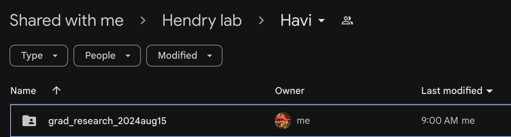
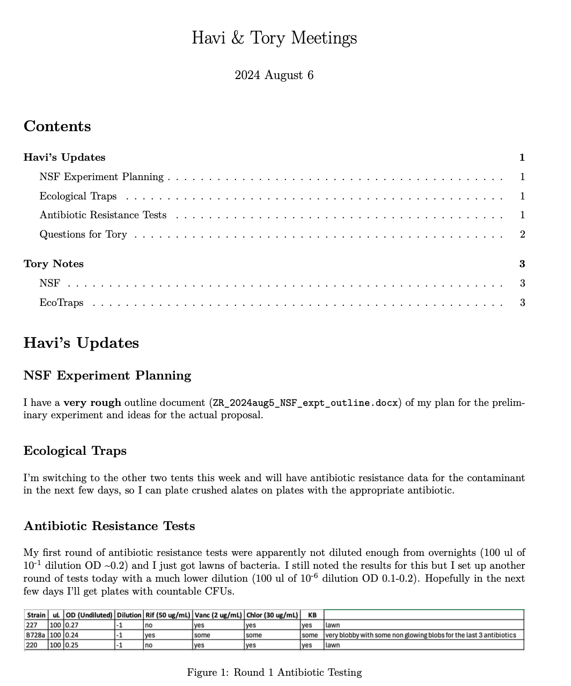
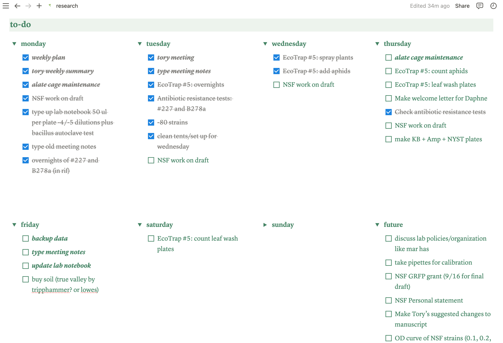

```{r setup, include=FALSE}
knitr::opts_chunk$set(echo = TRUE)
```

## Welcome to the Hendry Lab!

We're so excited to have you! Here are some guidelines, tips, and general info so you can have a smooth transition into the lab. You'll be meeting with Tory to discuss her expectations and research goals for you, so this letter will focus more on lab orientation and organization.

First, you'll want to pick a desk. Most of them are available right now, so you have many options! You can decorate your desk however you like (within reason) but remember that we're not supposed to eat food in the lab. Technically we're not supposed to drink water either, but unless EHS (Environmental Health and Safety) are doing a lab inspection, no one really enforces that.

Tory will also discuss expectations for working hours. Typically, I like to come in to lab around 8am and stay until 1-4pm, depending on how much physical lab work I have to do. If I don't have a lot, I usually leave early and work from home the rest of the day. Whatever you decide schedule-wise, be sure to keep Tory in the loop so she knows when to expect you in the lab or when to email you instead.

## Data Storage and Organization

It's essential to keep your lab space tidy and organized so you can find any files you need. Most of your files will probably be digital, so you might think this won't be a problem. However, digital organization is actually super important! Tory will discuss lab notebooks in more detail with you, but I've had a good experience keeping a digital lab notebook, then printing it out at the end of each week and taping the pages into a physical lab notebook. I also upload my digital lab notebook to the lab GitHub (<https://github.com/Hendry-Lab>) and Google Drive (<https://drive.google.com/drive/folders/1TlOhvj7-SGuR7mUJxmdoX1dgxRF65I_S?usp=drive_link>) every Friday.

I like to make one big folder on my laptop called `Hendry_Lab` and keep lots of sub-folders inside of it. This way I can easily upload everything in the `Hendry_Lab` folder to Google Drive each week and just note the date I updated it.

{width="500"}

{width="500"}

You should note that Tory does not currently use the GitHub. She knows about it; she just prefers to use the Google Drive. The reason I recommend using GitHub is so that other lab members can easily access your data if they continue your projects and for your own organization and version control. Using GitHub forces you to be organized, plus if you accidentally lose or delete files, it can help you recover them. If you've never used GitHub before, I can help you set it up, and you can also go to the department's Hacky Hour (run by the Schmidt Lab downstairs to teach coding skills). Once you get your GitHub set up, I recommend cloning the `lab_protocols` repository.

You'll also want to have Tory add you to the LabArchives, where we keep some spreadsheets for our lab strains. I personally never use LabArchives to store my data, as I don't like the user interface, but you can use it as an alternative to Google Drive if you prefer.

I also recommend doing a monthly hard drive backup of all your files, juuuuuuuust in case! I bought a \$15 64 GB flash-drive and I just upload everything in my `Hendry_Lab` folder there once a month.

If you've worked in a lab before, you're probably familiar with keeping lab notebooks and storing your data. If not, please let me know and I can help you out! I like to use RMarkdown for my digital lab notebook (and most of my writing) but Microsoft Word, Google Docs, and Benchling are also good options.

## Lab Equipment and Where to Find Things

### The Autoclave

### The Biosafety Cabinet ("The Hood")

### The Plate Incubator

### The Shaker

### The Centrifuge

### The Fridge

### The -40C Freezer

### The -80C Freezer

### The Plant Room

### The Aphid Room

### Bottles, Test Tubes, and Beakers (Oh My!)

## Lab Chores

### Miscellaneous Tips

-   I recommend preparing a weekly summary of what you've worked on/data you've collected/experiments you've run/papers you've read/questions for your meeting with Tory each week. If you send this to her the day before, it helps make meetings go more smoothly.

{width="500"}

-   I don't know if you've used Zotero before to organize your academic articles but I highly recommend it!

-   To plan my week, I use Notion. If you're interested in learning how to use it, just let me know! I love to share my organization tips.

{width="500"}

-   There's a great puzzle table outside of our lab in the hallways. Everyone in the building is welcome to contribute to it. If you have any puzzles you'd like to bring in, feel free!

-   There is also a snack table by the break room (across from the Feaga lab). Anything on it is up for grabs *EXCEPT* that the Feaga and Gallagher labs buy donuts for their lab meeting and leave them out every Monday even though they are not up for grabs. I don't know why they do this, since it's very confusing (and tempting), but just don't eat any donuts that are out on Monday. You can eat them on Tuesday though, after their lab meeting. As a general rule, if some of the donuts on the table have already been eaten, they're safe to take.

-   Speaking of food, during lunch everyday at 12pm, there is a Crossword Club that meets in the Schmidt Lab downstairs to do the NYT crossword religiously. I usually eat lunch with them, and it's open to anyone, so feel free to come by! You don't have to be good at crossword; it's just a fun time.
